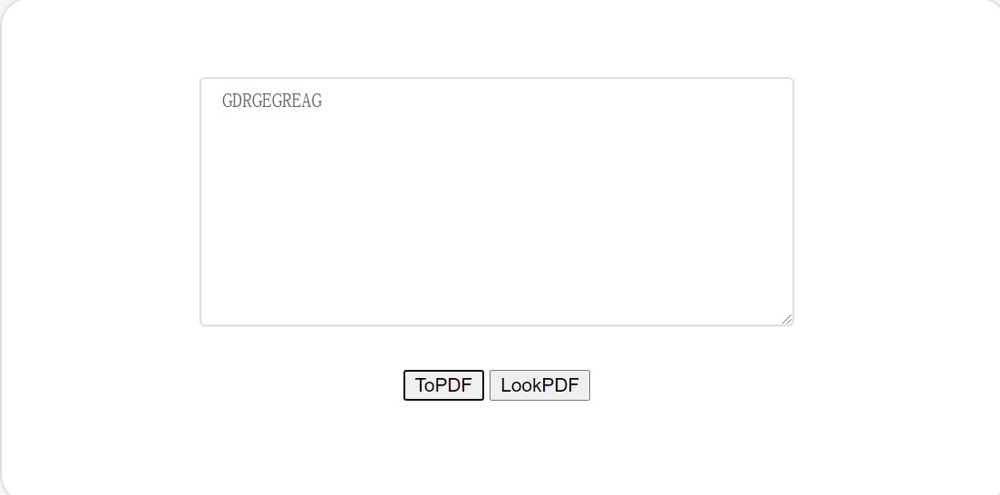

# web-ap
##***Что это***
  - Это программа, которая может конвертировать информацию в изображения и сохранять на сервере.
  
##***Конфигурационная среда***
   - front -- Vue
   - backend -- Java ( springMVC)
   
##***Процедура включает в себя***
   - Пользовательский ввод, конвертировать картинку
	
   - login 
   
        
	
##***Элементы страницы для достижения необходимой конфигурации***  

> **Vue:**
 >> - Применить веб-шаблон
 >>
     - npm i element-ui -S 
     - import ElementUI from 'element-ui';
     - import 'element-ui/lib/theme-chalk/index.css';
     - Vue.use(ElementUI);
    
 >> - Оставить заявку на бэкэнд（Submit a request to the backend）
 >>
    - npm install axios
    - npm install --save axios vue-axios
    - import axios from 'axios'
    - import VueAxios from 'vue-axios'
    - Vue.use(VueAxios,axios)
    
 >> - Экспорт PDF（Export pdf
 >>
    - npm install --save html2canvas 
    - npm install jspdf --save
    - import html2Canvas from 'html2canvas'
    - import JsPDF from 'jspdf'
    
 >> - Хранить информацию для входа（Store login information）
 >>
    - npm install vuex --save
    - import Vuex from 'vuex'
    - Vue.use(Vuex)
    
 >> - Установите путь доступа к странице, установите ограничения доступа （Set the access path to the page, set access restrictions）
 >>
    - npm install vue-router
    - import VueRouter from 'vue-router'
    - Vue.use(VueRouter)
    
> **JAVA**
>> - Доступ к статическим ресурсам
>>
    <mvc:resoures location="",mapping>
    <servlet-mapping>
       <servlet-name>default</servlet-name>
       <url-pattern>*.pdf</url-pattern>
    </servlet-mapping>
>> - Побег JASON персонаж
>>
    <dependency>
       <groupId>org.apache.commons</groupId>
       <artifactId>commons-lang3</artifactId>
       <version>3.0</version>
     </dependency>
     
##***КАК код работает***
> **front**
>>
    npm run dev
> **backend**
>>
    Just IDEA run will be ok

>***Result***
>>
    
  
   
 
	
